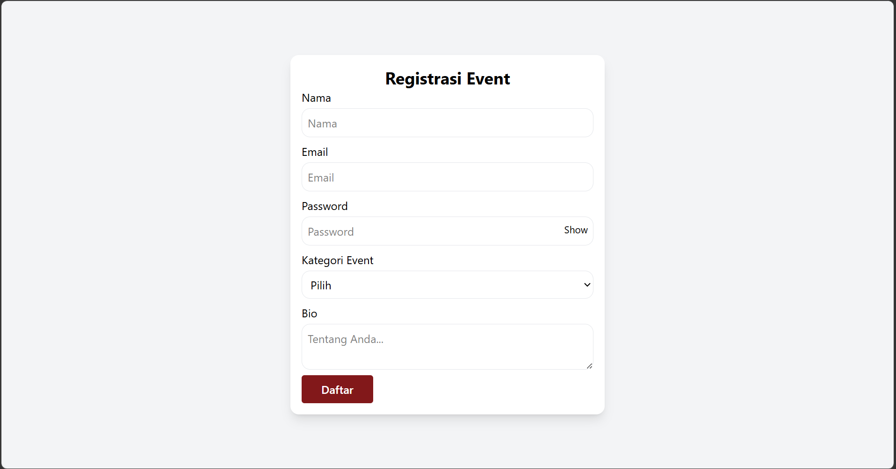
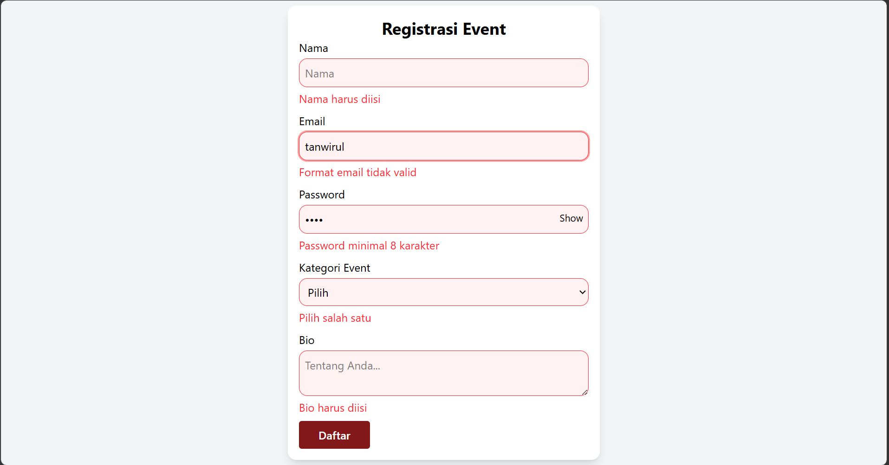
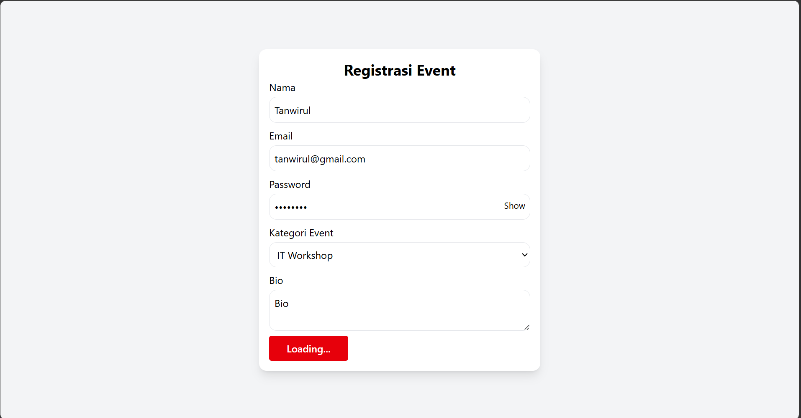

# Form Registrasi Event

## Hasil Akhir

Form Registrasi Event berisi:
* Nama Lengkap (Text).
* Email (Email validation).
* Password (Min. 8 karakter).
* Pilihan Kategori Event (Select).
* Bio Singkat (Textarea).

## Tampilan Saat Validasi Error

Form registrasi ini dilengkapi dengan validasi input menggunakan Zod. Form akan menampilkan pesan error jika input yang dimasukkan tidak sesuai dengan aturan. Saat tombol **Daftar** diklik tanpa mengisi data atau dengan data yang tidak valid, sistem akan menampilkan pesan error pada setiap field yang belum memenuhi ketentuan.

## Tampilan Saat Input Benar dan Berhasil

Tampilan ini menunjukkan kondisi form ketika semua input valid, sehingga tidak ada pesan error yang muncul. Saat tombol **Daftar** diklik, akan muncul teks **Loading...** sebagai tanda proses berlangsung, lalu setelah beberapa saat akan kembali menjadi **Daftar**. Selain itu, jika diperiksa melalui console pada browser, data yang diinput akan tampil, yang menandakan form telah berjalan dengan baik.